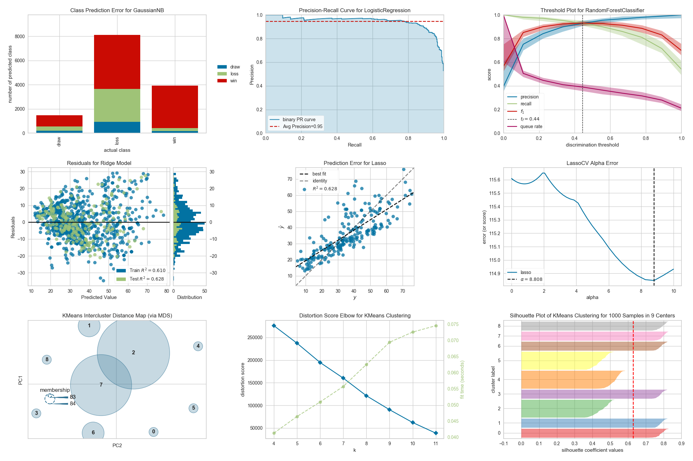

.. -*- mode: rst -*-
.. yellowbrick documentation master file, created by
    sphinx-quickstart on Tue Jul  5 19:45:43 2016.
    You can adapt this file completely to your liking, but it should at least
    contain the root `toctree` directive.

Yellowbrick: Visualización de Machine Learning
==============================================

Yellowbrick amplía la API Scikit-Learn para facilitar la selección de modelos y el ajuste de hiperparámetros. En su núcleo, usa Matplotlib.

Ruta de aprendizaje recomendada
-------------------------------

1. Revisa el :doc:`quickstart`, utiliza el :doc:`tutorial`, y también revisa :doc:`oneliners`.

2. Use Yellowbrick en su trabajo, haciendo referencia a :doc:`api/index` para obtener ayuda con visualizadores específicos e información detallada sobre parámetros opcionales y personalización.

3. Síguenos en `GitHub <https://github.com/DistrictDataLabs/yellowbrick/>`_ y síguenos en `Twitter (@scikit_yb) <https://twitter.com/scikit_yb>`_ para que te enteres de los nuevos visualizadores tan pronto se agreguen.

Contribuyendo
-------------

¿Interesado en contribuir a Yellowbrick?  Yellowbrick es un proyecto acogedor e inclusivo y nos encantaría tenerte.
Seguimos el `Código de conducta de Python Software Foundation <http://www.python.org/psf/codeofconduct/>`_.

No importa tu nivel de habilidad técnica, puedes ayudar. Apreciamos los informes de errores, las pruebas de usuario, las solicitudes de funciones, las correcciones de errores, las mejoras de productos y las mejoras en la documentación.

¡Revisa la guía :doc:`contributing/index`!

Considera la posibilidad de unirte al `Google Groups Listserv <https://groups.google.com/forum/#!forum/yellowbrick>`_ listserve para que puedas responder preguntas.

¡Gracias por tus contribuciones!

Conceptos & API
---------------

Visualizadores
--------------
El objetivo principal de Yellowbrick es crear una API sensorial similar a Scikit-Learn.

Los visualizadores son los objetos centrales en Yellowbrick.
Son similares a los transformadores en Scikit-Learn.
Los visualizadores pueden envolver un estimador de modelo, de manera similar a "ModelCV" (e.g. `RidgeCV <http://scikit-learn.org/stable/modules/generated/sklearn.linear_model.RidgeCV.html>`_, `LassoCV <http://scikit-learn.org/stable/modules/generated/sklearn.linear_model.LassoCV.html>`_) .

Algunos de nuestros visualizadores más populares incluyen:

Características de las visualizaciones
~~~~~~~~~~~~~~~~~~~~~~~~~~~~~~~~~~~~~~

- :doc:`api/features/rankd`: clasificación por pares de características para detectar relaciones
- :doc:`api/features/pcoords`: visualización horizontal de instancias
- :doc:`Radial Visualization <api/features/radviz>`: comparación de instancias alrededor de una gráfica circular
- :doc:`api/features/pca`: proyección de instancias basadas en componentes principales
- :doc:`api/features/manifold`: visualización de alta dimensión con aprendizaje de múltiples
- :doc:`Joint Plots <api/features/jointplot>`: visualización directa de datos con selección de características

Clasificación de las visualizaciones
~~~~~~~~~~~~~~~~~~~~~~~~~~~~~~~~~~~~

- :doc:`api/classifier/class_prediction_error`: muestra los errores y ayuda a clasificarlos
- :doc:`api/classifier/classification_report`: representación visual de precisión, recall y F1
- :doc:`ROC/AUC Curves <api/classifier/rocauc>`: características del operador receptor y área bajo la curva
- :doc:`api/classifier/prcurve`: precisión vs recall para diferentes umbrales de probabilidad
- :doc:`Confusion Matrices <api/classifier/confusion_matrix>`: descripción visual de la toma de decisiones de clase
- :doc:`Discrimination Threshold <api/classifier/threshold>`: encuentra el umbral que mejor separa las clases binarias

Visualización en regresión
~~~~~~~~~~~~~~~~~~~~~~~~~~

- :doc:`api/regressor/peplot`: encuentra desgloses del modelo a lo largo del dominio del objetivo
- :doc:`api/regressor/residuals`: muestra la diferencia en los residuos de los datos de entrenamiento y prueba
- :doc:`api/regressor/alphas`: muestra cómo la elección del alfa influye en la regularización
- :doc:`api/regressor/influence`: mostrar la influencia de las instancias en la regresión lineal

Visualización en agrupación
~~~~~~~~~~~~~~~~~~~~~~~~~~~

- :doc:`K-Elbow Plot <api/cluster/elbow>`: selecciona k al usar el método elbow y otras métricas
- :doc:`Silhouette Plot <api/cluster/silhouette>`: selecciona k al visualizar los valores del coeficiente de silueta
- :doc:`api/cluster/icdm`: muestra la distancia relativa y el tamaño/importancia de las agrupaciones

Visualización de selección de modelos
~~~~~~~~~~~~~~~~~~~~~~~~~~~~~~~~~~~~~

-  :doc:`api/model_selection/validation_curve`: sintoniza un modelo con respecto a un solo hiperparámetro
-  :doc:`api/model_selection/learning_curve`: muestra si un modelo se podría beneficiar de más datos o menos complejidad
-  :doc:`api/model_selection/importances`: clasifica las entidades por importancia o coeficientes lineales para un modelo específico
-  :doc:`api/model_selection/rfecv`: encuentra el mejor subconjunto de características en función de la importancia

Visualización en objetivos
~~~~~~~~~~~~~~~~~~~~~~~~~~

- :doc:`api/target/binning`: genera un histograma con líneas verticales que muestra el punto de valor recomendado para agrupar los datos en contenedores distribuidos uniformemente
- :doc:`api/target/class_balance`: visualiza cómo afecta la distribución de clases al modelo
- :doc:`api/target/feature_correlation`: muestra la correlación entre características y variables dependientes

Visualización de texto
~~~~~~~~~~~~~~~~~~~~~~

- :doc:`Term Frequency <api/text/freqdist>`: visualiza la distribución de frecuencias de términos en el cuerpo
- :doc:`api/text/tsne`: usa la incrustación estocástica de elementos vecinos para proyectar documentos
- :doc:`api/text/dispersion`: visualiza cómo se dispersan los términos clave a lo largo de un cuerpo
- :doc:`api/text/umap_vis`: traza los documentos similares más juntos para descubrir agrupaciones
- :doc:`api/text/postag`: traza los recuentos de diferentes partes del habla a lo largo de un cuerpo objetivo

... y más! Los visualizadores se agregan todo el tiempo. Compruebe los ejemplos (o incluso la `develop branch <https://github.com/DistrictDataLabs/yellowbrick/tree/develop>`_). ¡Siéntete libre de contribuir con tus ideas para nuevos visualizadores!

Obtener ayuda
-------------

¿Algo no te funciona? Aquí puedes encontrar ayuda.

1. Los documentos (¡estás aquí!).
2. `Stack Overflow <http://stackoverflow.com/questions/tagged/yellowbrick>`_. Si haces una pregunta, etiquétela con "yellowbrick".
3. The Yellowbrick `Google Groups Listserv <https://groups.google.com/forum/#!forum/yellowbrick>`_.
4. Puedes hacer un tweet o enviarnos mensajes directos en Twitter `@scikit_yb <https://twitter.com/scikit_yb>`_.

¿Encontraste un error?
----------------------

Compruebe si ya hay un `issue <https://github.com/DistrictDataLabs/yellowbrick/issues/>`_ sobre el tema. Si es necesario, presente un `issue <https://github.com/DistrictDataLabs/yellowbrick/issues/>`_.

Código abierto
--------------

La `licencia de Yellowbrick <https://github.com/DistrictDataLabs/yellowbrick/blob/master/LICENSE.txt>`_ es una licencia de código abierto `Apache 2.0 <http://www.apache.org/licenses/LICENSE-2.0>`_. ¡Yellowbrick disfruta de una comunidad de desarrolladores muy activa; por favor revisa :doc:`contributing/index`!

Yellowbrick está alojado en `GitHub <https://github.com/DistrictDataLabs/yellowbrick/>`_. Los `issues <https://github.com/DistrictDataLabs/yellowbrick/issues/>`_ y `pull requests <https://github.com/DistrictDataLabs/yellowbrick/pulls>`_ son rastreados aquí.

Tabla de contenido
------------------

.. toctree::
   :maxdepth: 2

   quickstart
   tutorial
   api/index
   oneliners
   contributing/index
   matplotlib
   teaching
   gallery
   about
   faq
   evaluation
   code_of_conduct
   changelog
   governance/index

Indices and tables
------------------

* :ref:`genindex`
* :ref:`modindex`
