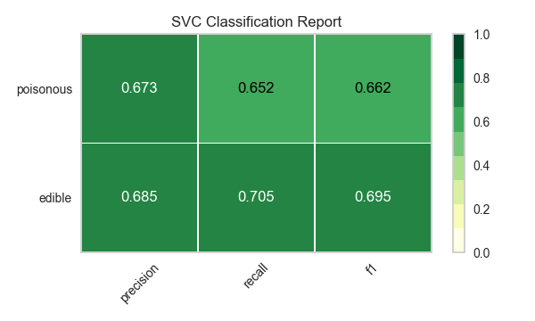
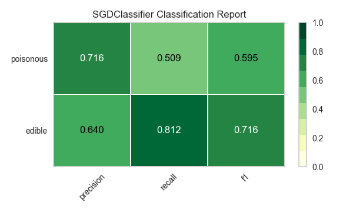
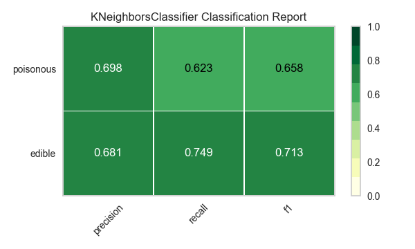
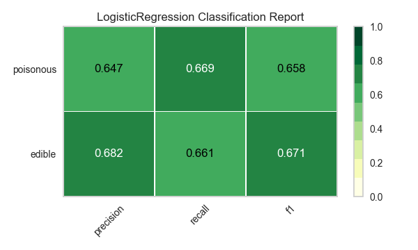
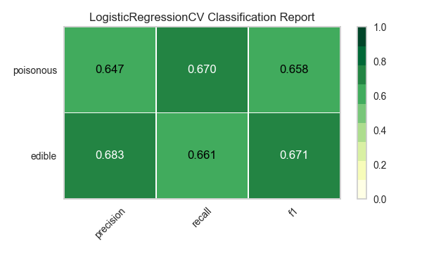
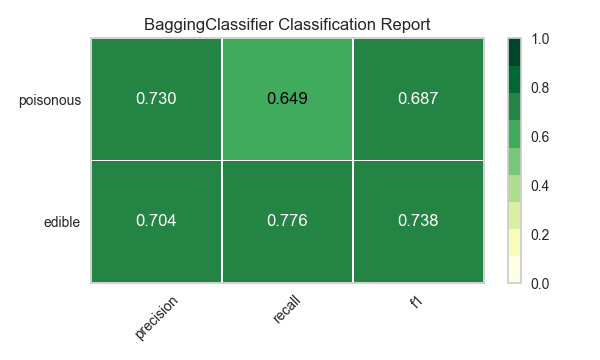

.. -*- mode: rst -*-

Tutorial de selección de modelos
================================

En este tutorial, vamos a ver los puntajes de una variedad de modelos `scikit-Learn <http://scikit-learn.org>`__ y compararlos utilizando herramientas de diagnóstico visual de `Yellowbrick <http://www.scikit-yb.org>`__ para seleccionar el mejor modelo para nuestros datos.

La triple selección de modelos
------------------------------
Las discusiones sobre el aprendizaje automático o machine learning por su traducción al inglés, a menudo se ven afectadas por un enfoque singular en la selección de modelos. Ya sea regresión logística, bosques aleatorios, métodos bayesianos o redes neuronales artificiales, los profesionales del machine learning a menudo se apresuran a expresar sus preferencias. La razón de esto es principalmente histórica. Aunque las bibliotecas modernas de machine learning de terceros han hecho que la implementación de múltiples modelos parezca casi trivial, tradicionalmente la aplicación y el ajuste de incluso uno de estos algoritmos requirió muchos años de estudio. Como resultado, los practicantes de machine learning tendían a tener fuertes preferencias por modelos particulares (y probablemente más familiares) sobre otros.

Sin embargo, la selección de modelos es un poco más matizada que simplemente elegir el algoritmo "correcto" o "incorrecto". En la práctica, el flujo de trabajo incluye:

  1. seleccionar y/o diseñar el conjunto de características más pequeño y predictivo
  2. elegir un conjunto de algoritmos de una familia de modelos, y
  3. ajustar los hiperparámetros del algoritmo para optimizar el rendimiento.

La **triple selección de modelos** fue descrito por primera vez en un artículo de 2015 SIGMOD_ por Kumar et al. En su artículo, que se refiere al desarrollo de sistemas de bases de datos de próxima generación construidos para anticipar el modelado predictivo, los autores expresan convincentemente que tales sistemas son muy necesarios debido a la naturaleza altamente experimental del machine learning en la práctica. “La selección de modelos”, explican, “es iterativa y exploratoria porque el espacio de la [triple selección de modelos] suele ser infinito, y generalmente es imposible para los analistas saber a priori qué [combinación] producirá una precisión y/o ideas satisfactorias”.

Recientemente, gran parte de este flujo de trabajo se ha automatizado a través de métodos de búsqueda en cuadrícula, API estandarizadas y aplicaciones basadas en GUI. En la práctica, sin embargo, la intuición y la orientación humanas pueden perfeccionarse más eficazmente en los modelos de calidad que la búsqueda exhaustiva. Al visualizar el proceso de selección de modelos, los científicos de datos pueden dirigirse hacia modelos finales y explicables y evitar dificultades y trampas.

La biblioteca Yellowbrick es una plataforma de visualización de diagnóstico para machine learning que permite a los científicos de datos dirigir el proceso de selección de modelos.  Yellowbrick amplía la API scikit-Learn con un nuevo objeto principal: el visualizador. Los visualizadores permiten que los modelos visuales se ajusten y transformen como parte del proceso Scikit-Learn Pipeline, proporcionando diagnósticos visuales a lo largo de la transformación de datos de alta dimensión.

.. _SIGMOD: http://cseweb.ucsd.edu/~arunkk/vision/SIGMODRecord15.pdf

Acerca de los datos
-------------------

T Este tutorial utiliza los datos hongo del módulo Yellowbrick :doc:`api/datasets/index`. Nuestro objetivo es predecir si un hongo es venenoso o comestible en función de sus características.

.. NOTE:: La versión YB de los datos de hongos difiere del conjunto de datos de hongos del `UCI Machine Learning Repository <http://archive.ics.uci.edu/ml/>`__. La versión Yellowbrick ha sido modificada deliberadamente para hacer que el modelado sea un poco más desafiante.

Los datos incluyen descripciones de muestras hipotéticas correspondientes a 23 especies de hongos branquiales en la familia Agaricus y Lepiota. Cada especie fue identificada como definitivamente comestible, definitivamente venenosa, o de comestibilidad desconocida y no recomendada (su última clase se combinó con la venenosa).

Nuestros datos contienen información para 3 atributos nominalmente valorados y un valor objetivo de 8124 casos de hongos (4208 comestibles, 3916 venenosos).

Vamos a cargar los datos:

.. code:: python

    from yellowbrick.datasets import load_mushroom

    X, y = load_mushroom()
    print(X[:5]) # inspeccionar las primeras cinco filas

.. parsed-literal::

            shape  surface     color
    0      convex   smooth    yellow
    1        bell   smooth     white
    2      convex    scaly     white
    3      convex   smooth      gray
    4      convex    scaly    yellow

Extracción de características
-----------------------------

Nuestros datos, incluido el objetivo, son categóricos. Tendremos que cambiar estos valores a numéricos para machine learning. Para extraer esto del conjunto de datos, tendremos que usar transformadores scikit-learn para transformar nuestro conjunto de datos de entrada en algo que pueda ajustarse a un modelo. Afortunadamente, scikit-learn proporciona transformadores para convertir etiquetas categóricas en enteros numéricos:
`sklearn.preprocessing.LabelEncoder <http://scikit-learn.org/stable/modules/generated/sklearn.preprocessing.LabelEncoder.html>`__ and `sklearn.preprocessing.OneHotEncoder <http://scikit-learn.org/stable/modules/generated/sklearn.preprocessing.OneHotEncoder.html>`__.

Usaremos una combinación del objeto ``Pipeline`` de scikit-learn (`Zac Stewart <https://twitter.com/zacstewart>`__ tiene `una gran publicación <http://zacstewart.com/2014/08/05/pipelines-of-featureunions-of-pipelines.html>`__ sobre el uso de pipelines), ``OneHotEncoder``, y ``LabelEncoder``:

.. code:: python

    from sklearn.pipeline import Pipeline
    from sklearn.preprocessing import OneHotEncoder, LabelEncoder

    # Objetivos de codificación de etiquetas antes del modelado
    y = LabelEncoder().fit_transform(y)

    # Columnas de codificación one-hot antes del modelado
    model = Pipeline([
     ('one_hot_encoder', OneHotEncoder()),
     ('estimator', estimator)
    ])

Modelado y Evaluación
---------------------

Métricas comunes para evaluar clasificadores
~~~~~~~~~~~~~~~~~~~~~~~~~~~~~~~~~~~~~~~~~~~~

**Precisión** es el número de resultados positivos correctos dividido por el
número de todos los resultados positivos (por ejemplo, *¿Cuántos de los hongos que predijimos que serían comestibles lo fueron en realidad?*).

**Recall** es el número de resultados positivos correctos dividido por el
número de resultados positivos que deberían haberse devuelto (por ejemplo, *Cuántos de los hongos que eran venenosos predijimos con precisión que eran venenosos?*).

La **puntuación F1** es una medida de la precisión de una prueba. Considera ambos
la precisión y el recall de la prueba para calcular la puntuación. La puntuación F1
puede interpretarse como un promedio ponderado de la precisión y
el recall, donde un puntaje de F1 alcanza su mejor valor en 1 y el peor en 0.

::

    precisión = verdaderos positivos / (verdaderos positivos + falsos positivos)

    recall = verdaderos positivos / (falsos negativos + verdaderos positivos)

    puntuación F1 = 2 * ((precisión * recall) / (precisión + recall))

¡Ya estamos listos para hacer algunas predicciones!

Construyamos una forma de evaluar múltiples estimadores, primero usando
puntuaciones numéricas tradicionales (que luego compararemos con algunos diagnósticos visuales de la biblioteca Yellowbrick).

.. code:: python

    from sklearn.metrics import f1_score
    from sklearn.pipeline import Pipeline
    from sklearn.svm import LinearSVC, NuSVC, SVC
    from sklearn.neighbors import KNeighborsClassifier
    from sklearn.preprocessing import OneHotEncoder, LabelEncoder
    from sklearn.linear_model import LogisticRegressionCV, LogisticRegression, SGDClassifier
    from sklearn.ensemble import BaggingClassifier, ExtraTreesClassifier, RandomForestClassifier

    models = [
        SVC(gamma='auto'), NuSVC(gamma='auto'), LinearSVC(),
        SGDClassifier(max_iter=100, tol=1e-3), KNeighborsClassifier(),
        LogisticRegression(solver='lbfgs'), LogisticRegressionCV(cv=3),
        BaggingClassifier(), ExtraTreesClassifier(n_estimators=300),
        RandomForestClassifier(n_estimators=300)
    ]

    def score_model(X, y, estimator, **kwargs):
        """
        Pruebe varios estimadores.
        """
        y = LabelEncoder().fit_transform(y)
        model = Pipeline([
            ('one_hot_encoder', OneHotEncoder()),
            ('estimator', estimator)
        ])

        # Instanciar el modelo de clasificación y el visualizador
        model.fit(X, y, **kwargs)

        expected  = y
        predicted = model.predict(X)

        # Calcular y devolver F1 (media armónica de precisión y recall)
        print("{}: {}".format(estimator.__class__.__name__, f1_score(expected, predicted)))

    for model in models:
        score_model(X, y, model)

.. parsed-literal::

    SVC: 0.6624286455630514
    NuSVC: 0.6726016476215785
    LinearSVC: 0.6583804143126177
    SGDClassifier: 0.5582697992842696
    KNeighborsClassifier: 0.6581185045215279
    LogisticRegression: 0.6580434509606933
    LogisticRegressionCV: 0.6583804143126177
    BaggingClassifier: 0.6879633373770051
    ExtraTreesClassifier: 0.6871364804544838
    RandomForestClassifier: 0.687643484132343

Evaluación preliminar del modelo
~~~~~~~~~~~~~~~~~~~~~~~~~~~~~~~~

Según los resultados de los puntajes de F1 anteriores, ¿qué modelo es el mejor?

Evaluación del modelo visual
----------------------------

Ahora refactoricemos nuestra función de evaluación de modelos para usar la clase``ClassificationReport`` de Yellowbrick, un visualizador de modelos que muestra la precisión, el recall y las puntuaciones de F1. Esta herramienta de análisis de modelos visuales integra puntuaciones numéricas, así como mapas de calor codificados por colores para admitir una fácil interpretación y detección, particularmente los matices del error Tipo I y Tipo II, que son muy relevantes (incluso salvavidas) para nuestro caso de uso.

**Error de tipo I** (o un **"falso positivo"**) es detectar un efecto que no está presente (por ejemplo, determinar que un hongo es venenoso cuando de hecho es comestible).

**Error de tipo II** (o un **"falso negativo"**) no detecta un efecto que está presente (por ejemplo, creer que un hongo es comestible cuando en realidad es venenoso).

.. code:: python

    from sklearn.pipeline import Pipeline
    from yellowbrick.classifier import ClassificationReport

    def visualize_model(X, y, estimator, **kwargs):
        """
        Pruebe varios estimadores.
        """
        y = LabelEncoder().fit_transform(y)
        model = Pipeline([
            ('one_hot_encoder', OneHotEncoder()),
            ('estimator', estimator)
        ])

        # Instanciar el modelo de clasificación y el visualizador
        visualizer = ClassificationReport(
            model, classes=['edible', 'poisonous'],
            cmap="YlGn", size=(600, 360), **kwargs
        )
        visualizer.fit(X, y)
        visualizer.score(X, y)
        visualizer.show()

    for model in models:
        visualize_model(X, y, model)

Reflexión
---------

1. ¿Qué modelo parece mejor ahora? ¿Por qué?
2. ¿Cuál es la más probable que te salve la vida?
3. ¿En qué se diferencia la experiencia de evaluación del modelo visual de la evaluación del modelo numérico?
